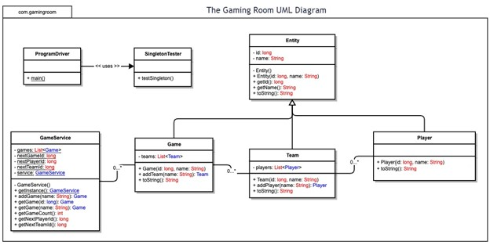

# 🎮 CS-230: Gaming Room App

## 📖 Project Overview
This project was developed for *The Gaming Room*, a client that wanted to expand their Android-based game **Draw It or Lose It** into a scalable, cross-platform web application. The goal was to design a system that could handle unique game/team/player instances, maintain performance, and prioritize user experience and security.

---

## 🛠 What I Did
- Designed and documented the system architecture, including UML diagrams and requirements analysis.  
- Implemented core features with **design patterns**:  
  - **Singleton** – ensures only one instance of the game service exists in memory.  
  - **Iterator** – enforces uniqueness of game, team, and player names.  
- Created a secure, efficient system structure that emphasized user-friendly error handling and constraints.  
- Recommended **Windows as the primary platform** for user familiarity and performance, while ensuring cross-platform capability through a web-based architecture.  

---

## 💡 Key Skills Demonstrated
- Software Engineering & Documentation  
- Design Patterns (Singleton, Iterator)  
- UML Diagrams & Requirements Analysis  
- User-Centered and Secure Design Principles  
- Maven Project Structure & Config Management  

---



---

## 🚀 How to Run
1. Build the project with Maven:
   ```bash
   mvn clean package
java -jar target/*-SNAPSHOT.jar server config.yml

curl http://localhost:8081/healthcheck
